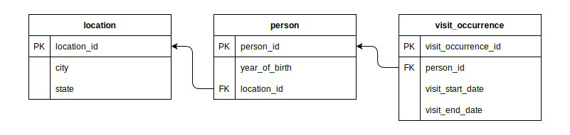
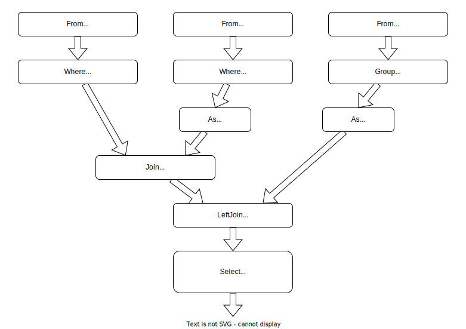

# funsql-python

[](https://pypi.org/project/funsql-python/)
[](https://github.com/ananis25/funsql-python/releases)
[](https://github.com/ananis25/funsql-python/blob/main/LICENSE)

`funsql` is a python library to write SQL queries in a way that is more composable. 

SQL is tricky to write in a modular fashion since it is a DSL with its own grammar. The straightforward way to compose SQL query fragments then must rely on string interpolation/concatenation, extended with a templating language like Jinja.

FunSQL exposes the full expressive power of SQL by implementing the SQL verbs _(FROM, WHERE, GROUP BY, ...)_ as regular python objects with compositional semantics. Specifically when you need to construct SQL queries programmatically, the pipeline style of composing queries can be very useful.  

This implementation closely follows the original Julia library `FunSQL.jl`.  Thanks to the original authors, Clark Evans and Kyrylo Simonov, who have been refining the idea for some time; you should check their previous work [here](https://querycombinators.org/).  
1. Presentation from JuliaCon talking about FunSQL - [youtube](https://www.youtube.com/watch?v=rGWwmuvRUYk) | [slides](https://github.com/MechanicalRabbit/FunSQL.jl/files/7465997/FunSQL-JuliaCon2021.pdf)
2. Julia library repo - [FunSQL.jl](https://github.com/MechanicalRabbit/FunSQL.jl/)


Please continue below for notes on using the python library, and how FunSQL works. 


## Contents

- [Example](#example)
- [Usage](#usage)
- [Concept](#concept)
- [More notes](#more-notes)
- [Installation](#installation)
- [Development](#development)


## Example

_When was the last time each person born between 1930 and 1940 and living in Illinois was seen by a healthcare provider?_

<details><summary>Database Schema</summary>



</details>

<details><summary>Pipeline Diagram</summary>



</details>

<details open><summary>Python Code</summary>

```python
# define the source tables
location = SQLTable(S.location, [S.location_id, S.city, S.state])
person = SQLTable(S.person, [S.person_id, S.year_of_birth, S.location_id])
visit_occurence = SQLTable(
    S.visit_occurence,
    [S.visit_occurence_id, S.person_id, S.visit_start_date, S.visit_end_date],
)

# construct queries incrementally
people_in_grp = From(person) >> Where(Fun("between", Get.year_of_birth, 1930, 1940))
people_in_il = people_in_grp >> Join(
    From(location) >> Where(Fun("=", Get.state, "IL")) >> As(S.loc),
    on=Fun("=", Get.location_id, Get.loc.location_id),
)
people_visits = people_in_il >> Join(
    From(visit_occurence) >> Group(Get.person_id) >> As(S.visit_grp),
    on=Fun("=", Get.person_id, Get.visit_grp.person_id),
    left=True,
)
people_last_visits = people_visits >> Select(
    Get.person_id,
    Get.visit_grp >> Agg.max(Get.visit_start_date) >> As(S.last_visit_date),
)

render(people_last_visits)
```

</details>

<details><summary>Output SQL query</summary>

```sql
SELECT
  "person_2"."person_id", 
  "visit_grp_1"."max" AS "last_visit_date"
FROM (
  SELECT
    "person_1"."location_id", 
    "person_1"."person_id"
  FROM "person" AS "person_1"
  WHERE ("person_1"."year_of_birth" BETWEEN 1930 AND 1940)
) AS "person_2"
INNER JOIN (
  SELECT "location_1"."location_id"
  FROM "location" AS "location_1"
  WHERE ("location_1"."state" = 'IL')
) AS "loc_1" ON ("person_2"."location_id" = "loc_1"."location_id")
LEFT JOIN (
  SELECT
    "visit_occurence_1"."person_id", 
    max("visit_occurence_1"."visit_start_date") AS "max"
  FROM "visit_occurence" AS "visit_occurence_1"
  GROUP BY "visit_occurence_1"."person_id"
) AS "visit_grp_1" ON ("person_2"."person_id" = "visit_grp_1"."person_id")
```
</details>

<br>

FunSQL models the SQL semantics as a set of operations on tabular data.  SQL clauses like `FROM`, `WHERE`, and `JOIN` are represented using instances of `From`, `Where`, and `Join` classes, and they are applied in sequence by connecting them with the `>>` operator.  Note the absence of a FunSQL counterpart to nested `SELECT` clauses; when necessary, FunSQL automatically adds nested subqueries and
threads column references and aggregate expressions through them. 

Scalar expressions are represented using: 
* `Get.person_id` is a reference to a column. 
* `Get.loc.person_id` refers to a column fenced by `As(S.loc)`. Aliasing helps disambiguate column references. 
* `Fun.between` and `Fun("==", ...)` is how FunSQL represents SQL functions and operators. 
* `Agg.max` is a notation for aggregate functions. 

FunSQL queries and their intermediate components are first-class python objects.  So, they can be constructed independently, passed around as values, and freely composed together.  

You'd also note writing expressions isn't particularly convenient; `Fun("between", Get.year_of_birth, 1930, 1940)` is too verbose for a data manipulation DSL.  While part of the reason is, operator overloading might surface bugs I haven't thought through, it also illustrates the usefulness of FunSQL being just a python library; you can build your own abstractions! 

<br>

<details>
<summary>Writing your own primitives</summary>

```python
# A left-join operator, for when passing an extra arg is tedious
def LeftJoin(*args, **kwargs):
    return Join(*args, left=True, **kwargs)

# shorthand for an equality expression
def eq(a, b):
    return Fun("=", a, b)

# this can directly be subbed as arguments in a `Select` node
def get_stats(col):
    return [
        Agg.max(col) >> As("max_val"), 
        Agg.min(col) >> As("min_val"), 
        Agg.mean(col) >> As("mean_val"),
        Agg.stddev(col) >> As("stddev_val"),
    ]
```
</details>

<br>

## Usage

To get started, please go through the [user guide](https://nbviewer.ipython.org/github/ananis25/funsql-python/blob/main/docs/usage-guide.ipynb).  The FunSQL equivalents for the available SQL expressions are documented [here](https://nbviewer.ipython.org/github/ananis25/funsql-python/blob/main/docs/tests/using-nodes.ipynb). 

The [funsql-examples](https://github.com/ananis25/funsql-examples/) repository adds examples of queries/projects written using FunSQL. 


## Concept

Writing a FunSQL query is much like assmembling the logical query plan in a SQL engine; `Where`, `Join`, `Select` _functions_ correspond to  `FILTER`, `JOIN`, `PROJECTION` nodes in a query plan.  The useful bit FunSQL improves at, is allowing column references (including aggregates) to be specified as late as possible.  When a query is rendered, FunSQL goes over the full query pipeline and asserts if it is valid.  Consider a segment of the example query above, where we want to query over visits made by each patient. 

```python
q = (
    From(person)
    >> Join(
        From(visit_occurence) >> Group(Get.person_id) >> As(S.visit_grp), on= ..., left=True,
    )
    >> Where(...)
    >> Select(..., Get.visit_grp >> Agg.max(Get.visit_start_date))
)
```

Note that we join the person records with the visits records already grouped by each person. However, we didn't have to explicitly specify the aggregation over all visit start dates, until we needed to report the last visit date.  FunSQL tracks the shape of the data, as SQL operations are applied to it, letting us construct modular queries.  For example, if you want to compute some other aggregation over patient visits, you just need to swap the last `Select` statement! 

The `docs` directory has more notes on how the compiler works, and the debugging output for some sample queries. 


## More notes

**Supported SQL subset?**

Window functions, nested queries, lateral joins, CTEs. are all supported.  Aggregation queries like Cube/Rollup, Grouping Sets, etc. haven't been implemented yet. 
FunSQL is oblivious to the specific UDF/aggregate functions supported by database engines, if they fit the `Fun` node syntax, FunSQL can include it in the output SQL query.


**Supported database engines?**

FunSQL is not a database connector and only produces the SQL query string.  Currently, it can produce queries in the Sqlite/Postgres dialect.  Maybe MySQL, but I have never used it. 

As noted above, FunSQL models the shape of the data, and its namespace through different tabular operations.  After resolving column references, and verifying the query is legitimate, FunSQL compiles the input tree of SQL nodes to a tree of SQL clause objects.  These directly translate to SQL text, only abstracting over spaces and dialect specific punctuation. 

However, SQL dialects are plenty and projects like [Apache Calcite](https://calcite.apache.org/) already exist, that can write to different variants of SQL.  A better idea is to compile the FunSQL query treee to the relational node structure `Calcite` works with. That would let us support the popular database engines (and I can delete 1000 lines from the code). 

The blocker is that `Calcite` is a Java library; I have never written Java, and don't know how to compile it to a native extension that is usable from python without installing a JVM.  When projects like [Substrait](https://substrait.io/) are further along, it might be a good idea to use that as a backend instead. 


**Supported languages?**

This repository implements a python library, while the original implementation of FunSQL is in Julia.  The core idea of tracking column references and data shape is not a lot of code and easy enough to port.  Once we can integrate with the Substrait/Calcite projects, I intend to write a Rust implementation, so individual language bindings are even shorter. 


**Similar projects?**

There are multiple libraries/languages that make writing SQL easier. The comparison below is not fully accurate since I haven't used the non-python tools significantly. 

* Pipeline DSLs: [dplyr](https://github.com/tidyverse/dplyr), [prql](https://github.com/prql/prql), [ibis](https://github.com/ibis-project/ibis). 

    These query languages define a set of `verbs`, each representing a table operation and let us define analytics queries incrementally. The FunSQL Julia library can be used similarly, with the distinction that the `query verbs` are closer to their SQL counterparts. However, the analytical DSLs are generally more concise to query data. Further, the python FunSQL implementation doesn't sugar the syntax at all and is clunky to directly write queries in. 
    
    The benefit of FunSQL is that query fragments are regular objects in the host language (Julia/Python), and can be manipulated or composed freely. This makes writing your own query DSLs on top of it, or extending it to support new syntactic features easy! Though I would think projects like `prql` and `ibis` can probably be used similarly by working with their internal compiler representations. 

* ORMs: [SQLAlchemy](https://www.sqlalchemy.org/). 

    ORMs simplify interaction with databases by letting us define language constructs like python classes mapping to database tables, and then writing queries by calling methods on them.  I would expect the SQLAlchemy core library can be used to build queries incrementally, but haven't delved into it much. 

* Query Builders: [PyPika](https://github.com/kayak/pypika). 

    Pypika converts a data structure assembled in python to a SQL query string, and shares the scope of FunSQL.   However, it is a thin wrapper around SQL expressions and doesn't model the semantics of SQL operations, resulting in incorrect output. 

        ```python
        from pypika import Query, Table
        c = Table("customers")
        q1 = Query.from_(c).limit(100).where(c.city == "Mumbai").select(c.name)
        q2 = Query.from_(c).where(c.city == "Mumbai").limit(100).select(c.name)

        print(str(q1)) 
        # SELECT "name" FROM "customers" WHERE "city"='Mumbai' LIMIT 100
        print(str(q2))
        # SELECT "name" FROM "customers" WHERE "city"='Mumbai' LIMIT 100
        ```

* Other projects: [Malloy](https://github.com/looker-open-source/malloy) is a super cool project that models relational data and queries against it, using a single language.  Queries are constructed as resuable fragments that can be composed/nested arbitrarily, and get compiled to SQL at execution time. 

    FunSQL operators are similar in that they can be arbitrarily composed, though it doesn't implement the NEST operator yet.  It should be fun to use FunSQL for implementing a watered down version of Malloy in the language of your choice. Though Malloy is pretty comprehensive (database connectors, built in graphing, tracking lineage) and you should use it! 


## Installation

The FunSQL python library doesn't have any dependencies. Install this library using `pip`:

    $ pip install funsql-python


## Development

To contribute to this library, checkout the code in a new virtual enviroment. 

Now install the dependencies and test dependencies:

    pip install -e '.[test]'

To run the tests:

    pytest
